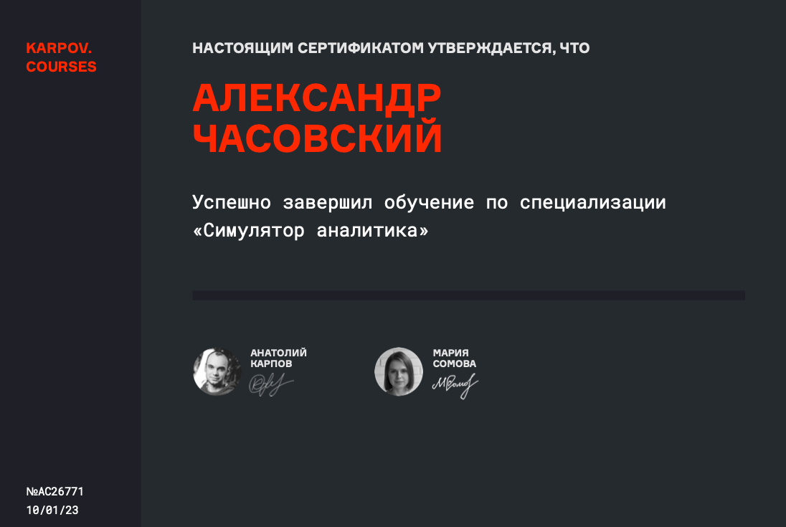
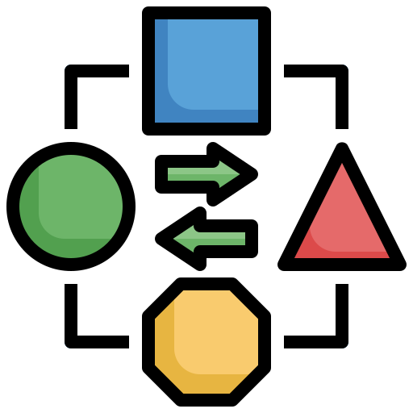

### О себе

Я работаю в аналитике более двух лет, владею ключевыми инструментами анализа данных (Git, Python, SQL, Clickhouse, Superset, Redash, ML-алгоритмы).  

Знаком с основными концепциями и методами, которые применяются при работе с данными. Имею опыт как научных исследований, так и решения бизнес-задач (продуктовые метрики, дашборды и аналитические отчеты, проведение A/B-тестов).

Ниже на странице представлены описания моих проектов с указанием соответствующих репозиториев.

### Контакты

https://t.me/a_chasovsky

### Повышение квалификации

### Аналитика данных

* #### pers_motogp_analytics &ensp; 

Анализ результатов гран-при чемпионата мира по мотогонкам MotoGP. По запросу пользователя скрипт автоматически скачивает протокол гонки в формате pdf (используя для этого разделы сайта, а не прямые ссылки), извлекает данные из pdf, преобразовывает их, считает метрики и строит итоговые графики.  

* #### kc_anomaly_detection_system &ensp; 

Система осуществляет поиск аномалий в данных в режиме, близкому к реальному времени (временной интервал - 15 минут). В качестве базового периода берутся средние значения аналогичного интервала за предыдущие 3 дня, считаются верхние и нижние пороги, и в случае обнаружения аномальных значений ответственному лицу отправляется сообщение в мессенджере Telegram.

* #### kc_etl_pipeline &ensp; 

Пайплайн выгружает данные из нескольких таблиц базы данных и рассчитывает агрегированные характеристики по некоторым метрикам. Итоговый датафрейм загружается обратно в базу данных в отдельную таблицу. Процедура повторяется один раз в сутки.

* #### kc_ab_test &ensp; 

### Машинное обучение

* #### kgl_heart_failure_prediction &ensp; 

Датасет Kaggle, в котором собраны данные по пациентам с подозрениями на сердечно-сосудистые заболевания. В рамках проекта протестировано несколько моделей машинного обучения, два подхода к кодированию категориальных переменных, дополнительно обучена нейронная сеть с двумя скрытыми слоями. 

* #### kgl_credit_card_fraud_detection &ensp; 

Датасет Kaggle, в котором осбраны данные о транзакциях кредитных карт, и необходимо решить задачу классификации - выявить мошеннические операции. Временные метки в проекте заданы неявно, соответственно алгоритм определяет время первой транзакции и на основании этого вводится дополнительный признак, который повышает эффективность модели.  

### Дополнительно

* #### test_tasks

Пример решенного тестового задания для одного из потенциальных работодателей.